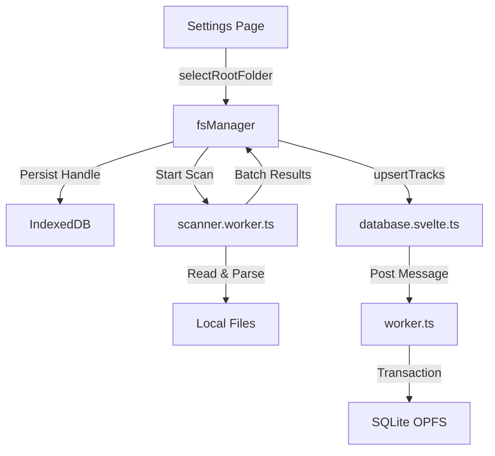

# CONTEXT.md — État du Projet Hylst Audio Player
> **Ce fichier est mis à jour par l'IA après chaque étape majeure.**

---

## 📍 ÉTAT ACTUEL (Dernière mise à jour : 2026-02-17 22:20)

### Phase active
**Phase 3 — File System Manager** (Scan & Lecture: ✅ / Écriture & Orga: ⏳)
**Prête à suivre : Phase 4 — Audio Engine** ou fin Phase 3

### Ce qui fonctionne
- **SvelteKit + PWA + Tailwind** (Phase 1)
- **Base de données SQLite persistante (OPFS)** (Phase 2)
- **File System Manager** (Phase 3)
  - **Sélection dossier** : via `showDirectoryPicker` + persistence handle IDB (`idb-keyval`).
  - **Scan Récursif** : Web Worker (`scanner.worker.ts`) traitant les sous-dossiers.
  - **Parsing Métadonnées** : `music-metadata` extrait ID3, Vorbis, MP4, covers.
  - **Batch Database Insert** : Performance optimisée via transactions SQL (50 tracks/batch).
  - **UI Settings** : Page `/settings` fonctionnelle pour ajouter une bibliothèque.

### Ce qui est en cours
- **Écriture des tags** : En investigation (P3-005).

### Prochaine action CRITIQUE
> 🎯 **Action immédiate :** Tester le scan avec de vrais fichiers audio.
> Si validé, passer à **Phase 4 (Audio Engine)** pour jouer ces fichiers.

### Architecture FS ↔ DB (Actuelle)

---

## 🔑 DÉCISIONS CLÉS (Mise à jour Phase 3)

1. **`music-metadata`** : Choisi pour sa robustesse et son support large de formats en pur JS/TS.
2. **Scanner Worker** : Obligatoire pour ne pas freezer l'UI pendant le parsing de milliers de fichiers.
3. **Batch Upsert** : Insertion par paquets de 50 pour réduire l'overhead de communication inter-workers (Worker FS -> Main -> Worker DB).
4. **IDB Persistence** : `idb-keyval` utilisé pour stocker le handle du dossier racine pour les rechargements futurs (nécessite re-validation permission user).

---

## 📦 DÉPENDANCES AJOUTÉES (Phase 3)

| Package | Usage |
|---|---|
| `music-metadata` | Parsing tags audio |
| `idb-keyval` | Stockage clé-valeur simple (Handles) |

---

## 📁 FICHIERS CLÉS CRÉÉS (Phase 3)

| Fichier | Rôle |
|---|---|
| `src/lib/fs/fileSystemManager.svelte.ts` | Store et orchestrateur FS |
| `src/lib/fs/scanner.worker.ts` | Worker de scan et parsing |
| `src/lib/fs/tagUtils.ts` | Mapping metadata -> DB Schema |
| `src/routes/settings/+page.svelte` | UI de gestion de bibliothèque |

---

## 📚 ARCHIVE DES ÉTATS PRÉCÉDENTS

### 📍 ÉTAT FIN PHASE 2 (Database)
- Base de données SQLite OPFS active
- Migration automatique
- Tests unitaires schema passés
