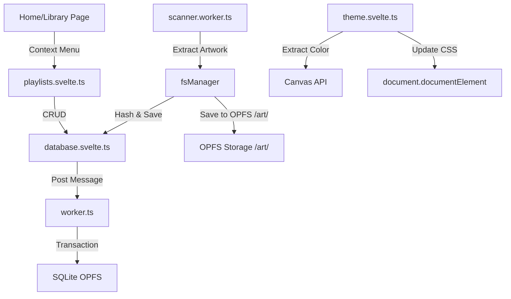

# CONTEXT.md — État du Projet Hylst Audio Player
> **Ce fichier est mis à jour par l'IA après chaque étape majeure.**

---

## 📍 ÉTAT ACTUEL (Dernière mise à jour : 2026-02-18 20:45)

### Phase active
**Phase 6 — UI Components** (✅ Home Page / ✅ Settings / ✅ Library / ✅ Dynamic Theme / ✅ Playlists)
**Phase 3 — File System Manager** (✅ Scan / ⏳ Tag Editing / ✅ Artwork Extraction)

### Ce qui fonctionne
- **SvelteKit + PWA + Tailwind** (Phase 1)
- **Base de données SQLite persistante (OPFS)** avec persistence OPFS confirmée (Phase 2)
- **File System Manager** (Phase 3) : Scan récursif, parsing métadonnées, extraction d'artwork et stockage OPFS.
- **Dynamic Theme** (Sprint 8) : Extraction de couleur d'artwork et injection de variables CSS.
- **Playlists** (Sprint 7) : Création, gestion, et ajout de sons aux playlists.
- **UI Components** (Phase 6) : 
  - **Home Page** : Glassmorphism, filtres (Tracks, Albums, Artists, Playlists).
  - **Library** : Redesign complet avec stats, tri et menus contextuels.
  - **Settings** : Gestion de la bibliothèque, export/import DB.

### Ce qui est en cours
- **Audio Engine** : Visualiseur de forme d'onde et effets audio.
- **Écriture des tags** : En investigation pour une alternative à music-metadata.

### Prochaine action CRITIQUE
> 🎯 **Action immédiate :** Finaliser le visualiseur audio et tester la persistence SQLite sur différents navigateurs.

### Architecture FS ↔ DB (Actuelle)

---

## 🔑 DÉCISIONS CLÉS (Mise à jour Phase 3)

1. **`music-metadata`** : Choisi pour sa robustesse et son support large de formats en pur JS/TS.
2. **Scanner Worker** : Obligatoire pour ne pas freezer l'UI pendant le parsing de milliers de fichiers.
3. **Batch Upsert** : Insertion par paquets de 50 pour réduire l'overhead de communication inter-workers (Worker FS -> Main -> Worker DB).
4. **IDB Persistence** : `idb-keyval` utilisé pour stocker le handle du dossier racine pour les rechargements futurs (nécessite re-validation permission user).

---

## 📦 DÉPENDANCES AJOUTÉES (Phase 3)

| Package | Usage |
|---|---|
| `music-metadata` | Parsing tags audio |
| `idb-keyval` | Stockage clé-valeur simple (Handles) |

---

## 📁 FICHIERS CLÉS CRÉÉS (Phase 5/6)

| Fichier | Rôle |
|---|---|
| `src/lib/theme/theme.svelte.ts` | Store de thème dynamique |
| `src/lib/audio/playlists.svelte.ts` | Store de gestion de playlists |
| `src/components/player/TrackContextMenu.svelte` | Menu contextuel pour les pistes |
| `src/components/playlists/PlaylistCreateDialog.svelte` | Dialog de création de playlist |
| `src/routes/library/+page.svelte` | Redesign de la page Library |

---

## 📚 ARCHIVE DES ÉTATS PRÉCÉDENTS

### 📍 ÉTAT FIN PHASE 2 (Database)
- Base de données SQLite OPFS active
- Migration automatique
- Tests unitaires schema passés
