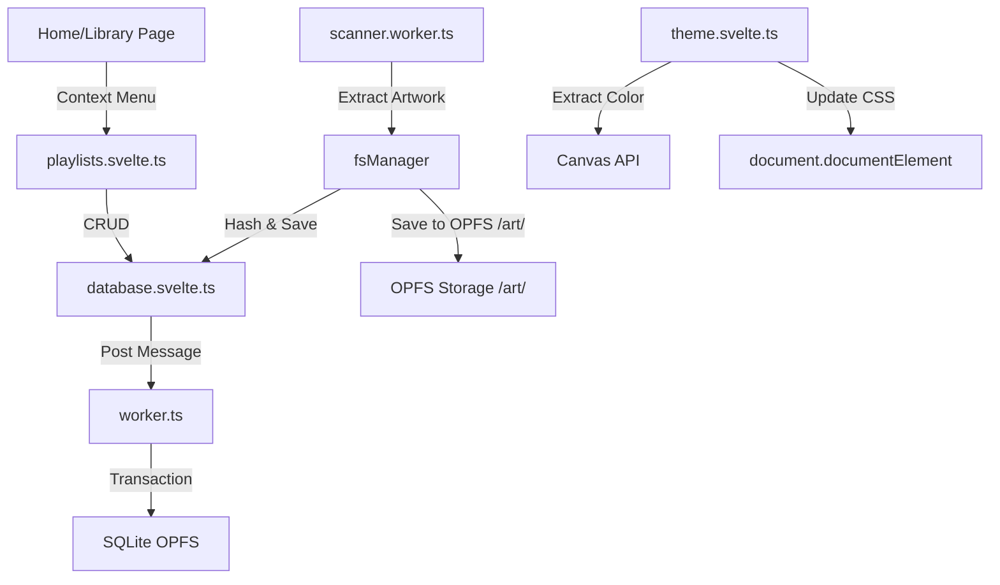

# CONTEXT.md — État du Projet Hylst Audio Player
> **Ce fichier est mis à jour par l'IA après chaque étape majeure.**

---

## 📍 ÉTAT ACTUEL (Dernière mise à jour : 2026-02-20)

### Phase active
**Phase 6 — UI Components** (✅ Home / ✅ Library / ✅ Player / ✅ Search / ✅ Profile / ✅ Playlist Detail / ✅ Settings/EQ)
**Phase 4 — Audio Engine** (⏳ EQ wiring / ⏳ Visualizer)

### Ce qui fonctionne
- **SvelteKit + PWA + Tailwind** (Phase 1)
- **Base de données SQLite persistante (OPFS)** (Phase 2)
- **File System Manager** (Phase 3) : Scan récursif, parsing métadonnées, artwork en OPFS.
- **Dynamic Theme** : Extraction de couleur d'artwork → variables CSS.
- **Playlists** : Création, gestion, ajout de tracks.
- **UI Components — Stitch Redesign complet** (Phase 6) :
  - **Home Page** : Glassmorphism, mini-player capsule, filter chips.
  - **Library** : Stats, tri, menus contextuels.
  - **Fullscreen Player** (`/player`) : Blur artwork bg, waveform-bar seeker, glass prev/next buttons, neon Play button, visualizer rings.
  - **Search** (`/search`) : Sticky glass input, history chips, Explore Vibes mood grid (6 tiles).
  - **Profile** (`/profile`) : Avatar avec aura radiale, stats bar 3 cols, artist scroller horizontal, activity timeline.
  - **Playlist Detail** (`/playlists/[id]`) : Hero artwork glow centré, Play All + Shuffle, glass-card track list.
  - **Settings/EQ** (`/settings`) : 10-band EQ UI avec presets, 3 toggles audio (Bass/3D/Vocal), pre-amp slider, library management.

### Ce qui est en cours
- **EQ** : Interface créée, câblage vers Web Audio API non fait.
- **Visualiseur** : Waveform bars static dans le Player, FFT Canvas à implémenter.

### Prochaine action CRITIQUE
> 🎯 **Action immédiate :** Câbler l'EQ UI (`/settings`) vers `audioEngine.ts` via `equalizer.ts`, puis visualiseur FFT Canvas.

### Architecture FS ↔ DB (Actuelle)

---

## 🔑 DÉCISIONS CLÉS (Mise à jour Phase 3)

1. **`music-metadata`** : Choisi pour sa robustesse et son support large de formats en pur JS/TS.
2. **Scanner Worker** : Obligatoire pour ne pas freezer l'UI pendant le parsing de milliers de fichiers.
3. **Batch Upsert** : Insertion par paquets de 50 pour réduire l'overhead de communication inter-workers (Worker FS -> Main -> Worker DB).
4. **IDB Persistence** : `idb-keyval` utilisé pour stocker le handle du dossier racine pour les rechargements futurs (nécessite re-validation permission user).

---

## 📦 DÉPENDANCES AJOUTÉES (Phase 3)

| Package | Usage |
|---|---|
| `music-metadata` | Parsing tags audio |
| `idb-keyval` | Stockage clé-valeur simple (Handles) |

---

## 📁 FICHIERS CLÉS CRÉÉS (Phase 5/6)

| Fichier | Rôle |
|---|---|
| `src/lib/theme/theme.svelte.ts` | Store de thème dynamique |
| `src/lib/audio/playlists.svelte.ts` | Store de gestion de playlists |
| `src/components/player/TrackContextMenu.svelte` | Menu contextuel pour les pistes |
| `src/components/playlists/PlaylistCreateDialog.svelte` | Dialog de création de playlist |
| `src/routes/library/+page.svelte` | Redesign de la page Library |

---

## 📚 ARCHIVE DES ÉTATS PRÉCÉDENTS

### 📍 ÉTAT FIN PHASE 2 (Database)
- Base de données SQLite OPFS active
- Migration automatique
- Tests unitaires schema passés
