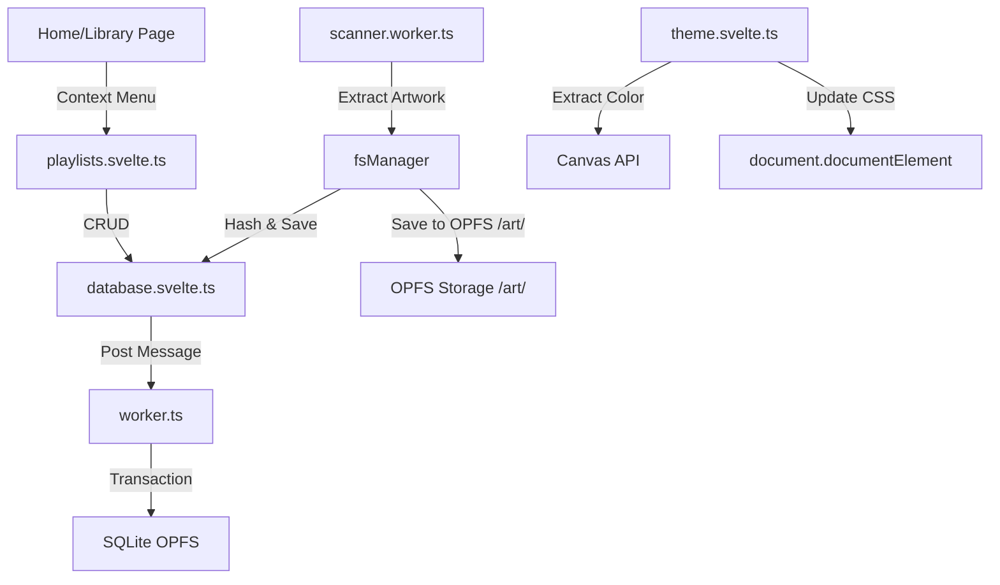

# CONTEXT.md — État du Projet Hylst Audio Player
> **Ce fichier est mis à jour par l'IA après chaque étape majeure.**

---

## 📍 ÉTAT ACTUEL (Dernière mise à jour : 2026-02-21)

### Phase active
**Phase 6 — UI Components** (✅ terminée)
**Phase 4 — Audio Engine** (⏳ EQ wiring / ⏳ Visualizer)
**Phase 7 — Features avancées** (✅ Multi-folder / ✅ Tag write-back / ✅ Metadata enrichment)

### Ce qui fonctionne
- **SvelteKit + PWA + Tailwind** (Phase 1)
- **Base de données SQLite persistante (OPFS)** (Phase 2) — Schema v4
- **File System Manager** (Phase 3) : Scan récursif, parsing métadonnées, artwork en OPFS.
  - ✅ **Multi-dossiers** : `rootHandles[]`, `addFolder()`, `removeFolder()`, `rescanAll()`, migration auto.
- **Tag write-back** :
  - ✅ MP3 via `browser-id3-writer` (ID3v2.3, frames complets)
  - ✅ FLAC : patch binaire du bloc Vorbis Comment
  - ✅ OGG Vorbis / OPUS : parser Ogg page-by-page + CRC32 + reconstruction paquet
- **Métadonnées fichier étendues (v4)** : `file_size`, `file_format`, `codec`, `codec_profile`, `tag_types`, `date_modified` — remontées au scan via `File` object.
- **Identification en ligne** : MusicBrainz + ✅ iTunes + ✅ Deezer (aggregés en parallèle, dédoublonnés).
- **Dynamic Theme** : Extraction de couleur d'artwork → variables CSS.
- **Playlists** : Création, gestion, ajout de tracks, `$derived.by()` réactivité.
- **Favoris** : Toggle optimiste avec rollback.
- **UI Components — Stitch Redesign complet** (Phase 6).
- **Context menu submenu** : positionnement smart (gauche si menu dans moitié droite).
- **Settings page** : EQ 10 bandes, gestionnaire multi-dossiers avec liste + add/remove/rescan.
- **Track detail** : Format, Codec, Tags, File Size, Modified affichés.

### Ce qui est en cours
- **EQ** : Interface créée, câblage vers Web Audio API non fait.
- **Visualiseur** : Waveform bars static dans le Player, FFT Canvas à implémenter.

### Prochaine action CRITIQUE
> 🎯 **Action immédiate :** Câbler l'EQ UI → `audioEngine.ts` via `equalizer.ts`, puis visualiseur FFT Canvas.

### Architecture FS ↔ DB (Actuelle)

## 🔑 DÉCISIONS CLÉS

1. **`music-metadata`** : Choisi pour sa robustesse et son support large de formats en pur JS/TS.
2. **Scanner Worker** : Obligatoire pour ne pas freezer l'UI pendant le parsing de milliers de fichiers.
3. **Batch Upsert** : Insertion par paquets de 50 pour réduire l'overhead inter-workers.
4. **Multi-dossiers** : `rootHandles[]` stocké dans IDB sous clé `hap_root_handles_v2`, migration auto depuis `hap_root_handle`.
5. **OGG/OPUS write-back** : Parser Ogg page-by-page natif (pas de lib externe), CRC32 polynomial `0x04c11db7`.
6. **Identification multi-source** : iTunes + Deezer (CORS proxy) + MusicBrainz — `Promise.allSettled`, dédoublonnage par `title|artist`.
7. **Settings 500** : Causé par `$effect` exécuté côté serveur lors de la génération du shell HTML SvelteKit — guard `typeof window`.

---

## 📦 DÉPENDANCES AJOUTÉES (Phase 3)

| Package | Usage |
|---|---|
| `music-metadata` | Parsing tags audio |
| `idb-keyval` | Stockage clé-valeur simple (Handles) |

---

## 📁 FICHIERS CLÉS CRÉÉS (Phase 5/6)

| Fichier | Rôle |
|---|---|
| `src/lib/theme/theme.svelte.ts` | Store de thème dynamique |
| `src/lib/audio/playlists.svelte.ts` | Store de gestion de playlists |
| `src/components/player/TrackContextMenu.svelte` | Menu contextuel pour les pistes |
| `src/components/playlists/PlaylistCreateDialog.svelte` | Dialog de création de playlist |
| `src/routes/library/+page.svelte` | Redesign de la page Library |

---

## 📚 ARCHIVE DES ÉTATS PRÉCÉDENTS

### 📍 ÉTAT FIN PHASE 2 (Database)
- Base de données SQLite OPFS active
- Migration automatique
- Tests unitaires schema passés
